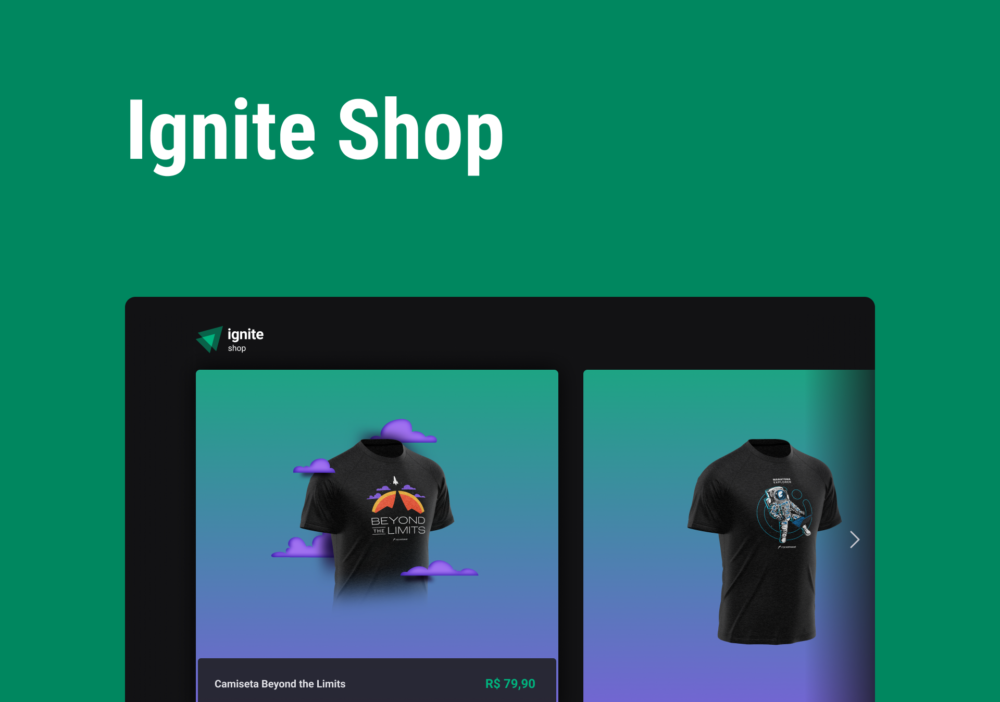

<h1 align="center">
  <a href="#">Ignite Shop</a>
  
  <br />

  
  
  
</h1>

<!-- <p align="center">Breve descrição do app</p> -->

<h5 align="center">
  🚧 Em construção 🚧
</h5>

## Projeto

<h1 align="center">
  
</h1>

<!-- ## Features
Em Breve -->

## Tecnologias utilizadas

Esse app utiliza várias coisas, como:

- [NextJS](https://nextjs.org/)
- [ReactJS](https://reactjs.org/)

<!-- ## Sobre o app

Descrição do APP -->

## Como recriar a aplicação?


### Pré-requisitos

Para rodar o app garanta que você tenha as seguintes ferramentas: [Git](https://git-scm.com), [Node.js](https://nodejs.org/en/).

### Rodando ao app

Clone este repositório
```
git clone git@github.com:mayromyller/ignite-shop.git
```

Instale as dependências
```
yarn install
```
ou
```
npm install
```

Inicia o projeto em modo desenvolvedor
```
dev
```

A aplicação irá rodar em: [http://localhost:3000](http://localhost:3000)
